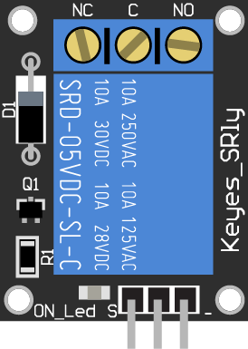
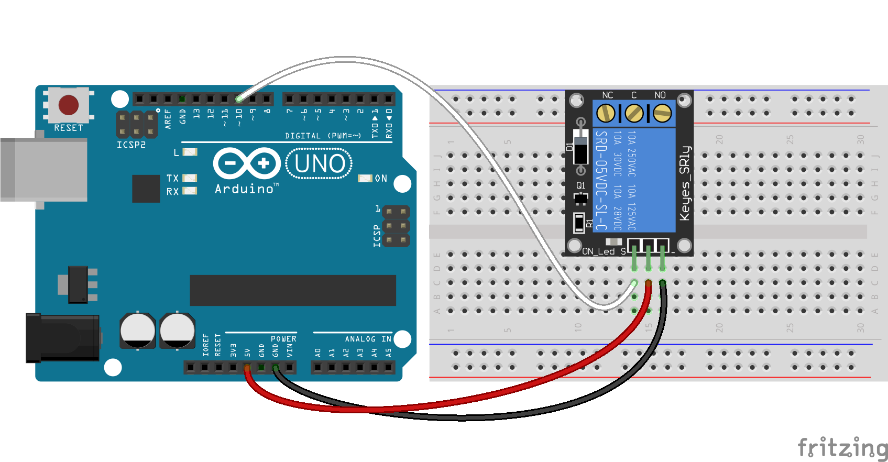
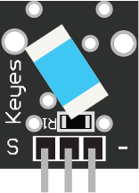
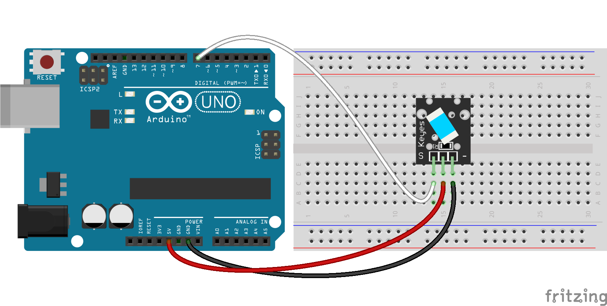

# Fritzing Components
This repo is a collection of components for use with [Fritzing](http://fritzing.org/).
## Keyes
### Keyes Relay
#### Breakout

#### Example

### Keyes Tilt Switch
#### Breakout

#### Example

